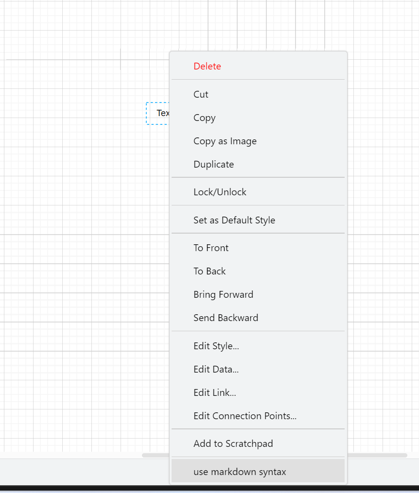
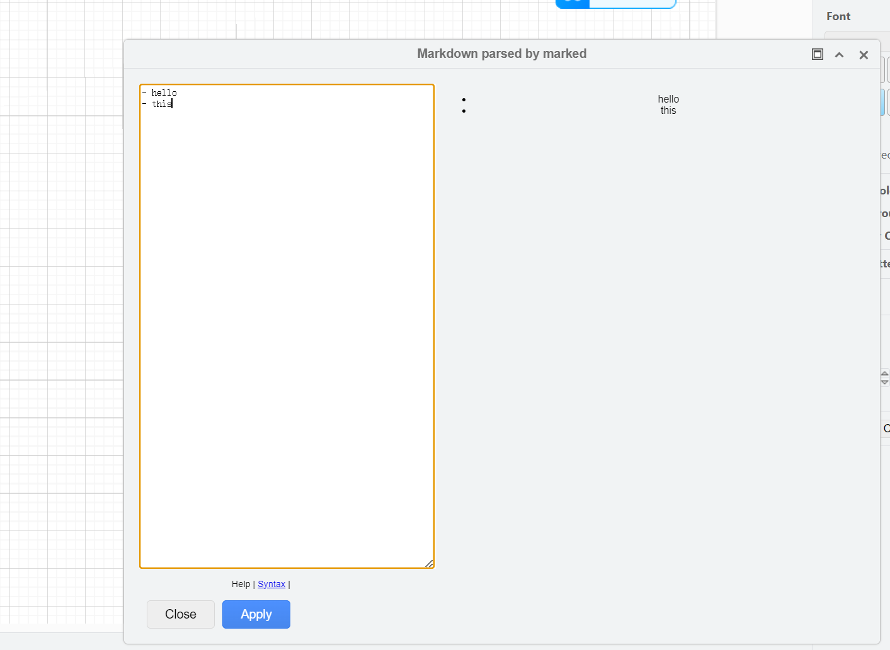
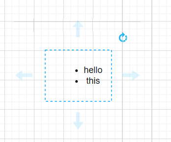

# Draw.io Desktop Markdown Plugin

This draw.io plugins integrates the markdown generator.

Markdown supports:

> different version support different function

- markdown: [v0.0.0](https://github.com/dzylikecode/drawio-plugin-markdown/tree/v0.0.0)
- Katex: [v0.1.0](https://github.com/dzylikecode/drawio-plugin-markdown/tree/v0.1.0)

## Overview

- Example

## Usage

- double click on a shape and edit the markdown script, the shape will be redrawn after leaving the editor







## Properties

- All markdown configuration options are reflected as draw.io shape properties.


## How to build

1. `git clone --recursive https://github.com/nopeslide/drawio_markdown_plugin.git ~/drawio_markdown_plugin`
2. `cd ~/drawio_markdown_plugin/drawio_desktop`
3. `npm install`
4. `npm run build`

# How to install

5. open draw.io desktop
6. select on the top menu bar `Extras`/`Plugins...`
7. click `Add`
8. click `Select File...` for `External Plugins:`
9. select `~/drawio_markdown_plugin/drawio_desktop/dist/markdown-plugin.webpack.js`
10. click `OK`
11. click `Apply`
12. confirm Dialog

---

copy the code in the `dist/`

**Draw.io copies the plugin into an internal directory, making updates impossible!**

To link the plugin with the repository:

13. run `ln -sfr ~/drawio_markdown_plugin/drawio_desktop/dist/markdown-plugin.webpack.js ~/.config/draw.io/plugins/`

## API

copy from drawio source code

```js
if (this.isHtmlLabel(cell)) {
  var temp = document.createElement("div");
  temp.innerHTML = Graph.sanitizeHtml(this.getLabel(cell));
  var links = temp.getElementsByTagName("a");
  var changed = false;

  for (var i = 0; i < links.length; i++) {
    href = links[i].getAttribute("href");

    if (href != null && href.substring(0, 17) == "data:action/json,") {
      links[i].setAttribute("href", this.updateCustomLink(mapping, href));
      changed = true;
    }
  }

  if (changed) {
    this.labelChanged(cell, temp.innerHTML);
  }
}
```

```js
// HTML entities are displayed as plain text in wrapped plain text labels
this.graph.cellRenderer.getLabelValue = function (state) {
  var result = mxCellRenderer.prototype.getLabelValue.apply(this, arguments);

  if (state.view.graph.isHtmlLabel(state.cell)) {
    if (state.style["html"] != 1) {
      result = mxUtils.htmlEntities(result, false);
    } else {
      result = Graph.sanitizeHtml(result);
    }
  }

  return result;
};
```

## References

- [External plugins in draw.io - DEV Community](https://dev.to/parrotypoisson/external-plugins-in-drawio-25hd)
- [nopeslide/drawio_mermaid_plugin: Mermaid plugin for drawio desktop](https://github.com/nopeslide/drawio_mermaid_plugin)
