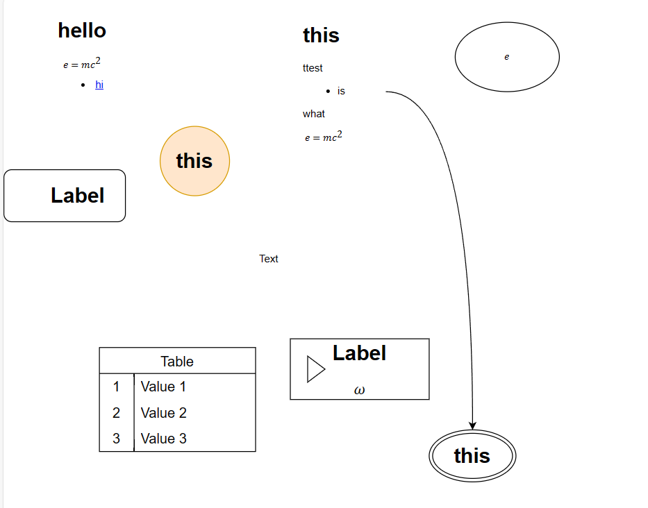
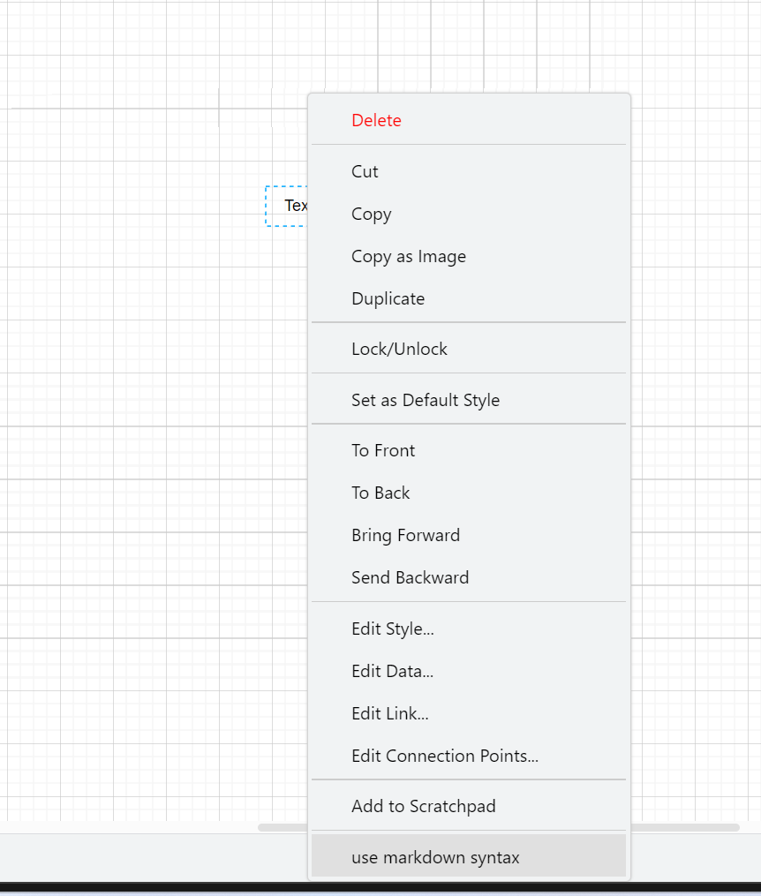
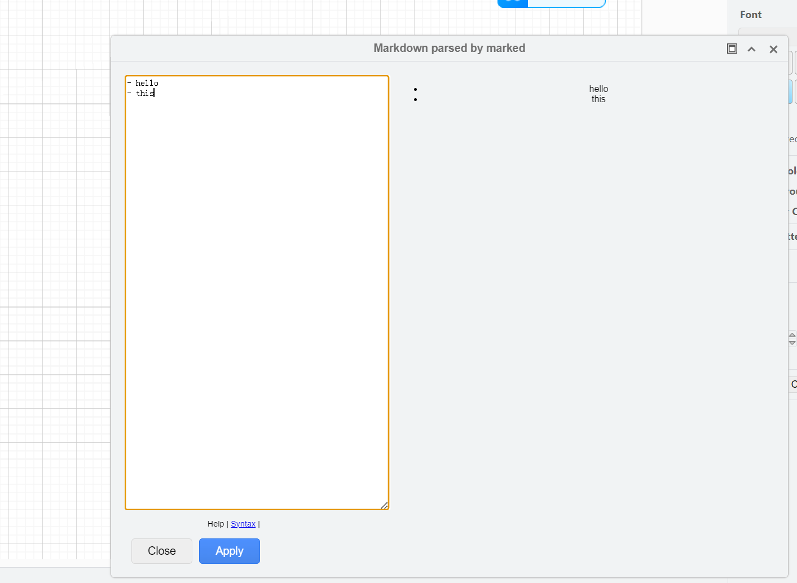
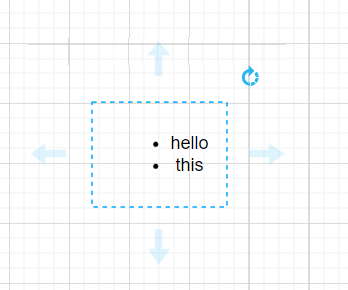

# Drawio.io Integration: Markdown Plugin

This is an extension for
[Draw.io Integration](https://marketplace.visualstudio.com/items?itemName=hediet.vscode-drawio)
or
[Draw.io Integration - Insider Build](https://marketplace.visualstudio.com/items?itemName=hediet.vscode-drawio)
that adds full markdown support.

Markdown supports:

- Markdown
- Katex
- highlight

## Installation

- VS Code Marketplace

## Overview

## Usage

- double click on a shape and edit the mermaid script, the shape will be redrawn after leaving the editor

## How to build

1. `git clone --recursive https://github.com/dzylikecode/drawio-plugin-markdown.git`
2. `cd drawio_mermaid_plugin/drawio_desktop`
3. `npm install`
4. `npm run build`
5. `cd ../vscode`
6. `npm install`
7. `npm run vscode:package`

## Draw.io desktop

See [github](https://github.com/dzylikecode/drawio-plugin-markdown) for the desktop variant of this plugin.

## References

- [nopeslide/drawio_mermaid_plugin: Mermaid plugin for drawio desktop](https://github.com/nopeslide/drawio_mermaid_plugin)
